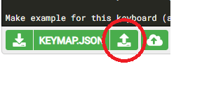

# Rect44 Build Guide

caution)  
Since a metal case with bent sheet metal is used, be careful not to get injured by cutting your hands.  
Also, there are many places that need to be soldered. To avoid burns and fire with the soldering iron, diligently remove the soldering iron from the power supply when you leave work.

## Preparation

### Check the included parts
- Board ... 1 sheet
- Stainless steel case ... 1 piece
- Stainless steel bottom plate ... 1 sheet
- ProMicro dropout prevention plate ... 1 sheet
- MX compatible socket ... 54 + 1 spare
- Diode (SMD type) ... 50 + 2 spares
- Schottky barrier diode (SMD type)… 1 piece
- Schottky barrier diode (TH type)… 1 piece
- Slide switch ... 1 piece
- Tact switch ... 1 piece
- AAA battery case ... 2 pieces
――12pin conthrough… 2
- M2 7mm spacer ... 2 pieces
- M2 6.5mm spacer ... 2 pieces
- M2 6mm spacer ... 2 pieces
- M2 pan head machine screw (with PW, SW) ... 4 pieces
- PCB support (long / short) ... 2 each
- M2.6 Low head screw ... 4 pieces
- M3 low head screw ... 10 pieces
- Cushion seal ... 4 pieces


| |![Case] ​​(./img/parts_02.jpg) | | | 
| ---- | ---- | ---- | ---- | 
| Board | Stainless Steel Case | Stainless Steel Bottom Plate | ProMicro Fall Prevention Plate | 
| | | | | 
| MX compatible socket | Diode | Shotkey barrier diode (SMD type) | Shotkey barrier diode (TH type) | 
| | |![AAA Battery Case] ​​(./img/parts_10.jpg) | .jpg) | 
| Slide Switch | Tact Switch | AAA Battery Case | 12pin Consul | 
| | ) | | |
| M2 spacer (7mm, 6.5mm, 6mm 2 each) | M2 pan head machine screw | PCB support | M2.6 low head screw | 
| | ||| 
| M3 low head screw | Cushion seal ||| 
### Parts to be prepared separately
- ProMicro or ProMicro compatible product: 1 piece
- MX compatible key switch: 44-48 depending on the layout
- Keycap: Matches the keyswitch and layout
- Stabilizer: Matches the key switch and layout


### Required tools
- Soldering iron (recommended with temperature control function)
- Solder
- A stand to put a soldering iron
- flux
- Flux cleaning liquid
- Tweezers
-+ Driver
- Nippers

### Things that should be there
- Tester
- Soldering wire
- Reverse action tweezers
- Mushimegane or loupe
- Radio pliers
- Heat resistant work mat
- Masking tape


## Firmware

We recommend using [BLE Micro Pro](https://nogikes.booth.pm/items/1177319) by ["Nogikesuya"](https://nogikes.booth.pm/).  
There is no need to build an environment to build the firmware, so it is easy and you will be able to make a Bluetooth connection.

### When using BLE Micro Pro
Please use the "type-c version" currently on sale. Simply edit and customize CONFIG.JSN and KEYMAP.JSN and copy them to BLE Micro Pro as described below.

Even if you use the one that was released before, you can use it with the same procedure as "type-c version" if you use "boot loader v0.2 version" or later. If you want to use an earlier boot loader version, you need to update the boot loader or build the firmware.

#### CONFIG.JSN
Copy and paste the following content and save it as CONFIG.JSN in any location. This file does not need to be changed if the keymap changes.
```
{"config":
	{
		"version": 2,
		"device_info": {"vid": "0xFEED", "pid": "0x0000", "name": "rect44", "manufacture": "koshinoya", "description": ""},
		"matrix": {"rows": 4, "cols": 13, "device_rows": 4, "device_cols": 13,
		"debounce": 1, "is_left_hand": 1, "diode_direction": 0,
		"row_pins": [1, 2, 19, 20],
		"col_pins": [18, 17, 16, 15, 14, 5, 6, 7, 8, 9, 10, 11, 12],
		"layout": [1, 2, 3, 4, 5, 6, 7, 8, 9, 10, 11, 12, 13, 0,
			 14, 15, 16, 17, 18, 19, 20, 21, 22, 23, 24, 25, 26, 0,
			 27, 28, 29, 30, 31, 32, 33, 34, 35, 36, 37, 38, 39, 0,
			 40, 41, 42, 43, 45, 46, 48, 49, 50, 51, 52]},
		"mode": "SINGLE", "startup": 1,
		"peripheral": {"max_interval": 60, "min_interval": 30, "slave_latency": 7},
		"central": {"max_interval": 60, "min_interval": 30, "slave_latency": 0},
		"led": {"pin": 255, "num": 0},
		"keymap": {"locale": "US", "use_ascii": 0}
}}
```

#### KEYMAP.JSN
KEYMAP.JSN will be customized according to the layout you choose.
The key code is the same as [QMK Keycordes](https://docs.qmk.fm/#/keycodes).  
[BLE Micro Pro specific key code](https://github.com/sekigon-gonnoc/BLE-Micro-Pro/blob/master/docs/edit_keymap_file.md#ble-micro-pro%E5%9B%BA% E6% 9C% 89% E3% 81% AE% E3% 82% AD% E3% 83% BC% E3% 82% B3% E3% 83% BC% E3% 83% 89) is also available, so please introduce it as appropriate. ..

The keys that change depending on the layout are "13", "25", "28", "38", "43", "45", "46", "48" in the CONFIG.JSN "layout" section. "am.
-"13" key: The upper right key in the ANSI array. Not available when using the ISO return key.
-"25" key: The key to the right of the semicolon in the ISO array. 2.25u Cannot be used when using the return key.
-"28" key: 1u key when the left Shift key is divided into 1.25u and 1u keys.
-"38" key: 1u key when the right Shift key is divided into 1u and 1.75u keys.
-"43" key: 6.25u This is the left 2.25u key when the space key is divided into three.
-"45" key: 6.25u space key.
-"46" key: 6.25u It is the middle 2.75u key when the space key is divided into three.
-"48" key: 6.25u It is the right 1.25u key when the space key is divided into three.

Sample for ANSI 44 key with 6.25u space bar.
```
{"layers":
[["KC_ESC", "KC_Q", "KC_W", "KC_E", "KC_R", "KC_T", "KC_Y", "KC_U", "KC_I", "KC_O", "KC_P", "KC_MINS", "KC_BSPC",
"LCTL_T (KC_TAB)", "KC_A", "KC_S", "KC_D", "KC_F", "KC_G", "KC_H", "KC_J", "KC_K", "KC_L", "KC_SCLN", "KC_NO" , "KC_ENT",
"KC_LSFT", "KC_NO", "KC_Z", "KC_X", "KC_C", "KC_V", "KC_B", "KC_N", "KC_M", "KC_COMM", "KC_DOT", "KC_NO", "RSFT_T" (KC_SLSH) ",
"LCTL_T (KC_DEL)", "KC_LGUI", "KC_LALT", "KC_NO", "LT (_FN, KC_SPC)", "KC_NO", "KC_NO", "KC_LEFT", "KC_DOWN", "KC_UP", "KC_RGHT" ",],

["KC_GRV", "KC_F1", "KC_F2", "KC_F3", "KC_F4", "KC_F5", "KC_F6", "KC_F7", "KC_F8", "KC_F9", "KC_F10", "KC_F11" KC_F12 ",
"KC_TRNS", "KC_1", "KC_2", "KC_3", "KC_4", "KC_5", "KC_6", "KC_7", "KC_8", "KC_9", "KC_0", "KC_NO", "KC_EQL" ",
"KC_TRNS", "KC_NO", "KC_APP", "MO (_FN2)", "KC_NO", "KC_NO", "KC_LBRC", "KC_RBRC", "KC_QUOT", "KC_TRNS", "KC_TRNS", "KC_NO" , "KC_BSLS",
"KC_INS", "KC_TRNS", "KC_TRNS", "KC_NO", "KC_TRNS", "KC_NO", "KC_NO", "KC_HOME", "KC_PGDN", "KC_PGUP", "KC_END",],

["ADV_ID0", "ADV_ID1", "ADV_ID2", "ADV_ID3", "ADV_ID4", "KC_NO", "KC_NO", "KC_NO", "KC_NO", "KC_PSCR", "KC_SLCK", "KC_PAUS", " KC_NO ",
"KC_CAPS", "KC_NO", "KC_NO", "KC_NO", "KC_NO", "KC_NO", "KC_NO", "KC_NO", "KC_NO", "KC_NO", "KC_NO", "KC_NO", "KC_NO" ",
"KC_TRNS", "KC_NO", "KC_NO", "KC_TRNS", "KC_NO", "KC_NO", "KC_NO", "KC_NO", "KC_NO", "KC_NO", "KC_NO", "KC_NO", "KC_NO" ",
"KC_LCTL", "KC_TRNS", "KC_TRNS", "KC_NO", "KC_TRNS", "KC_NO", "KC_NO", "KC_NO", "KC_NO", "KC_NO", "KC_NO",]}
```

Sample for ANSI 47 key with space key split into 3 and right Shift key split
```
{"layers":
[["KC_ESC", "KC_Q", "KC_W", "KC_E", "KC_R", "KC_T", "KC_Y", "KC_U", "KC_I", "KC_O", "KC_P", "KC_MINS", "KC_BSPC",
"LCTL_T (KC_TAB)", "KC_A", "KC_S", "KC_D", "KC_F", "KC_G", "KC_H", "KC_J", "KC_K", "KC_L", "KC_SCLN", "KC_NO" , "KC_ENT",
"KC_LSFT", "KC_NO", "KC_Z", "KC_X", "KC_C", "KC_V", "KC_B", "KC_N", "KC_M", "KC_COMM", "KC_DOT", "KC_SLSH", "RSFT_T" (KC_UP) ",
"LCTL_T (KC_DEL)", "KC_LGUI", "KC_LALT", "LT (1, KC_SPC)", "KC_NO", "RSFT_T (KC_SPC)", "KC_RALT", "MO (2)", "KC_LEFT", "KC_DOWN", "KC_RGHT",],

["KC_GRV", "KC_F1", "KC_F2", "KC_F3", "KC_F4", "KC_F5", "KC_F6", "KC_F7", "KC_F8", "KC_F9", "KC_F10", "KC_F11" KC_F12 ",
"KC_TRNS", "KC_1", "KC_2", "KC_3", "KC_4", "KC_5", "KC_6", "KC_7", "KC_8", "KC_9", "KC_0", "KC_NO", "KC_EQL" ",
"KC_TRNS", "KC_NO", "KC_APP", "KC_NO", "KC_NO", "KC_NO", "KC_LBRC", "KC_RBRC", "KC_QUOT", "KC_TRNS", "KC_TRNS", "KC_BSLS", "RSFT_T" (KC_PGUP) ",
"LCTL_T (KC_INS)", "KC_TRNS", "KC_TRNS", "KC_TRNS", "KC_NO", "KC_TRNS", "KC_TRNS", "KC_TRNS", "KC_HOME", "KC_PGDN", "KC_END",],

["ADV_ID0", "ADV_ID1", "ADV_ID2", "ADV_ID3", "ADV_ID4", "KC_NO", "KC_NO", "KC_NO", "KC_NO", "KC_PSCR", "KC_SLCK", "KC_PAUS", " KC_NO ",
"KC_CAPS", "KC_NO", "KC_NO", "KC_NO", "KC_NO", "KC_NO", "KC_NO", "KC_NO", "KC_NO", "KC_NO", "KC_NO", "KC_NO", "KC_NO" ",
"KC_TRNS", "KC_NO", "KC_NO", "KC_NO", "KC_NO", "KC_NO", "KC_NO", "KC_NO", "KC_NO", "KC_NO", "KC_NO", "KC_NO", "KC_NO" ",
"KC_LCTL", "KC_TRNS", "KC_TRNS", "KC_NO", "KC_NO", "KC_NO", "KC_NO", "KC_TRNS", "KC_NO", "KC_NO", "KC_NO",]}
`` ```

Sample for 48 keys with ISO Enter key
```
{"layers":
[["KC_ESC", "KC_Q", "KC_W", "KC_E", "KC_R", "KC_T", "KC_Y", "KC_U", "KC_I", "KC_O", "KC_P", "KC_DEL", "KC_NO",
"LCTL_T (KC_TAB)", "KC_A", "KC_S", "KC_D", "KC_F", "KC_G", "KC_H", "KC_J", "KC_K", "KC_L", "KC_SCLN", "KC_QUOT" , "KC_ENT",
"KC_LSFT", "LSFT_T (KC_NUBS)", "KC_Z", "KC_X", "KC_C", "KC_V", "KC_B", "KC_N", "KC_M", "KC_COMM", "KC_DOT", "KC_SLSH" , "RSFT_T (KC_UP)",
"LCTL_T (KC_INS)", "KC_LGUI", "KC_LALT", "LT (1, KC_SPC)", "KC_NO", "RSFT_T (KC_SPC)", "KC_RALT", "MO (2)", "KC_LEFT", "KC_DOWN", "KC_RGHT",],

["KC_GRV", "KC_F1", "KC_F2", "KC_F3", "KC_F4", "KC_F5", "KC_F6", "KC_F7", "KC_F8", "KC_F9", "KC_F10", "KC_BSPC" KC_NO ",
"KC_TRNS", "KC_1", "KC_2", "KC_3", "KC_4", "KC_5", "KC_6", "KC_7", "KC_8", "KC_9", "KC_0", "KC_MINS", "KC_EQL" ",
"KC_TRNS", "KC_NO", "KC_APP", "KC_NO", "KC_NO", "KC_NO", "KC_LBRC", "KC_RBRC", "KC_NUHS", "KC_TRNS", "KC_TRNS", "KC_BSLS", "RSFT_T" (KC_PGUP) ",
"KC_TRNS", "KC_TRNS", "KC_TRNS", "KC_TRNS", "KC_NO", "KC_TRNS", "KC_TRNS", "KC_TRNS", "KC_HOME", "KC_PGDN", "KC_END",],

["ADV_ID0", "ADV_ID1", "ADV_ID2", "ADV_ID3", "ADV_ID4", "KC_NO", "KC_NO", "KC_NO", "KC_NO", "KC_PSCR", "KC_SLCK", "KC_PAUS", " KC_NO ",
"KC_CAPS", "KC_NO", "KC_NO", "KC_NO", "KC_NO", "KC_NO", "KC_NO", "KC_NO", "KC_NO", "KC_NO", "KC_NO", "KC_NO", "KC_NO" ",
"KC_TRNS", "KC_NO", "KC_NO", "KC_NO", "KC_NO", "KC_NO", "KC_NO", "KC_NO", "KC_NO", "KC_NO", "KC_NO", "KC_NO", "KC_NO" ",
"KC_TRNS", "KC_TRNS", "KC_TRNS", "KC_NO", "KC_NO", "KC_NO", "KC_TRNS", "KC_TRNS", "KC_NO", "KC_NO", "KC_NO",]}
```

Copy and paste any of the above samples and save it as KEYMAP.JSN. Of course, customization is also OK.

#### write in
If you connect BLE Micro Pro to a PC with a USB cable, it will be recognized as if you connected a USB memory, so copy the created CONFIG.JSN and KEYMAP.JSN to the BLE Micro Pro side.

| |
| - -  |
| In the above figure, "name" in "device_info" of CONFIG.JSN is rect44-3, so it is recognized as such. |

CONFIG.JSN and KEYMAP.JSN are also available at the links below, so please rename them.  
https://github.com/sekigon-gonnoc/BLE-Micro-Pro/tree/master/AboutDefaultFirmware/keyboards/rect44

### When using ProMicro

#### Building the environment
Basically here  
[The Complete Newbs Guide To QMK](https://docs.qmk.fm/#/newbs)  
However, if you are not good at English  

[QMK firmware Basics of firmware 1](http://roudokuvip.hateblo.jp/entry/2018/04/29/013126)  
Is recommended.  
The series of descriptions from here was very helpful, and I saw this and built the environment of QMK.


#### Customize
[QMK Configurator](https://config.qmk.fm/) can be used, so if you enter `rect44` in` KEYBOARD: `, the ANSI 47 key version will be displayed.  
For other layouts (ANSI 44 keyboard layout and ISO 48 keyboard layout), copy and paste the following contents, save it as a `.json` file in any location, and click the` Import QMK Keymap JSON file` button in QMK Configurator. Press to load.  


ansi_44key.json (ANSI 44 key layout example)
```
{
  "keyboard": "rect44",
  "keymap": "default",
  "commit": "",
  "layout": "LAYOUT_ansi_44key",
  "layers": [
    [
      "KC_ESC", "KC_Q", "KC_W", "KC_E", "KC_R", "KC_T", "KC_Y", "KC_U", "KC_I", "KC_O", "KC_P", "KC_MINS", "KC_BSPC" ",
      "LCTL_T (KC_TAB)", "KC_A", "KC_S", "KC_D", "KC_F", "KC_G", "KC_H", "KC_J", "KC_K", "KC_L", "KC_SCLN", "KC_ENT" ,,
      "KC_LSFT", "KC_Z", "KC_X", "KC_C", "KC_V", "KC_B", "KC_N", "KC_M", "KC_COMM", "KC_DOT", "RSFT_T (KC_SLSH)",
      "LCTL_T (KC_DEL)", "KC_LGUI", "KC_LALT", "LT (1, KC_SPC)", "KC_LEFT", "KC_DOWN", "KC_UP", "KC_RGHT"
    ],,
    [
      "KC_GRV", "KC_F1", "KC_F2", "KC_F3", "KC_F4", "KC_F5", "KC_F6", "KC_F7", "KC_F8", "KC_F9", "KC_F10", "KC_F11", "KC_F11" ",
      "KC_TRNS", "KC_1", "KC_2", "KC_3", "KC_4", "KC_5", "KC_6", "KC_7", "KC_8", "KC_9", "KC_0", "KC_EQL",
      "KC_TRNS", "KC_APP", "MO (2)", "KC_NO", "KC_NO", "KC_LBRC", "KC_RBRC", "KC_QUOT", "KC_TRNS", "KC_TRNS", "KC_BSLS",
      "KC_INS", "KC_TRNS", "KC_TRNS", "KC_TRNS", "KC_HOME", "KC_PGDN", "KC_PGUP", "KC_END"
    ],,
    [
      "KC_NO", "RGB_TOG", "RGB_HUI", "RGB_SAI", "RGB_VAI", "KC_NO", "KC_NO", "KC_NO", "KC_NO", "KC_PSCR", "KC_SLCK", "KC_PAUS", "KC_NO" ",
      "KC_CAPS", "RGB_MOD", "RGB_HUD", "RGB_SAD", "RGB_VAD", "KC_NO", "KC_NO", "KC_NO", "KC_NO", "KC_NO", "KC_NO", "KC_NO",
      "KC_TRNS", "KC_NO", "KC_TRNS", "KC_NO", "KC_NO", "KC_NO", "KC_NO", "KC_NO", "KC_NO", "KC_NO", "KC_NO",
      "KC_LCTL", "KC_TRNS", "KC_TRNS", "KC_TRNS", "KC_NO", "KC_NO", "KC_NO", "KC_NO"
    ]
  ]
}
```
iso_ 48key.json (ISO 48 key layout example)
```
{
  "keyboard": "rect44",
  "keymap": "default",
  "commit": "",
  "layout": "LAYOUT_iso_48key",
  "layers": [
    [
      "KC_ESC", "KC_Q", "KC_W", "KC_E", "KC_R", "KC_T", "KC_Y", "KC_U", "KC_I", "KC_O", "KC_P", "KC_BSPC", "KC_ENT" ",
      "LCTL_T (KC_TAB)", "KC_A", "KC_S", "KC_D", "KC_F", "KC_G", "KC_H", "KC_J", "KC_K", "KC_L", "KC_SCLN", "KC_QUOT" ,,
      "KC_LSFT", "KC_NUBS", "KC_Z", "KC_X", "KC_C", "KC_V", "KC_B", "KC_N", "KC_M", "KC_COMM", "KC_DOT", "KC_SLSH", "RSFT_T" (KC_UP) ",
      "KC_LCTL", "KC_LGUI", "KC_LALT", "LT (1, KC_SPC)", "RSFT_T (KC_SPC)", "KC_RALT", "MO (2)", "KC_LEFT", "KC_DOWN", "KC_RGHT"
    ],,
    [
      "KC_GRV", "KC_F1", "KC_F2", "KC_F3", "KC_F4", "KC_F5", "KC_F6", "KC_F7", "KC_F8", "KC_F9", "KC_F10", "KC_DEL" ",
      "KC_TRNS", "KC_1", "KC_2", "KC_3", "KC_4", "KC_5", "KC_6", "KC_7", "KC_8", "KC_9", "KC_0", "KC_MINS",
      "KC_TRNS", "KC_NO", "KC_APP", "KC_F11", "KC_F12", "KC_NO", "KC_LBRC", "KC_RBRC", "KC_NUHS", "KC_TRNS", "KC_TRNS", "KC_TRNS", "KC_TRNS" ",
      "KC_INS", "KC_TRNS", "KC_TRNS", "KC_TRNS", "KC_TRNS", "KC_TRNS", "KC_TRNS", "KC_HOME", "KC_PGDN", "KC_END"
    ],,
    [
      "KC_NO", "RGB_TOG", "RGB_HUI", "RGB_SAI", "RGB_VAI", "KC_NO", "KC_NO", "KC_NO", "KC_NO", "KC_PSCR", "KC_SLCK", "KC_PAUS", "KC_NO" ",
      "KC_CAPS", "RGB_MOD", "RGB_HUD", "RGB_SAD", "RGB_VAD", "KC_NO", "KC_NO", "KC_NO", "KC_NO", "KC_NO", "KC_NO", "KC_NO",
      "KC_TRNS", "KC_NO", "KC_NO", "KC_NO", "KC_NO", "KC_NO", "KC_NO", "KC_NO", "KC_NO", "KC_NO", "KC_NO", "KC_NO", "KC_NO" ",
      "KC_LCTL", "KC_TRNS", "KC_TRNS", "KC_NO", "KC_TRNS", "KC_TRNS", "KC_TRNS", "KC_NO", "KC_NO", "KC_NO"
    ]
  ]
}
```  


If you would like to do something else, please use it as it has been merged into QMK.

## Assembly
From here, soldering work will be done in more than 200 places.  
For those who are unfamiliar with soldering work or who feel uneasy, go through the [WEB version soldering basic course](https://godhanda.co.jp/kouza/) published by God Soldering Co., Ltd. Recommended to read.

The side on which the parts are mounted is the side marked "Rect 44 v1.2" in the lower left.

### Key switch diode
The attached diode is a surface mount (SMD) type diode, but this board also allows through hole type diodes to be mounted, so if you are not confident in mounting the surface mount type, you will need a separate through hole. You can also get and install a type of diode. The recommended diode to use is "1N4148", which is easily available.  
[Akizuki Denshi Tsusho](https://akizukidenshi.com/catalog/g/gI-00941/)  
[TALP KEYBOARD](https://talpkeyboard.stores.jp/items/59eadbffc8f22c15de001638)  
You can get it at.

| |
| - -  |
| Solder by aligning the position of the diode mark bar on the board with the direction of the diode wire. Pre-solder one pad, solder it to that pad, and then solder the other. Again, I think that God Solder's [15 Soldering of chip parts (surface mounting)](https://godhanda.co.jp/blog/kisokouza15/) will be helpful. |

### Schottky barrier diode
Both surface mount (SMD) and through hole (TH) types are included as accessories, but only one is used. If you are not good at soldering surface mount type, please use through hole type.  
The method is the same as the diode for the key switch. Also, to improve workability, be sure to install it before the battery case.

| |
| - -  | - -  |
| The package is very similar to the diode for key switch, but the one with white dots is the Schottky barrier diode. | The mounting position is the pad marked with SDB1 and silk between the battery box and the controller mounting part. Solder the wire indicating the cathode of the diode toward the ProMicro mounting part. |
| |
| Schottky barrier diode (TH type) | The pad indicated by SDB1 and silk is the mounting position between the battery box and the controller mounting part. Solder the wire indicating the cathode of the diode toward the ProMicro mounting part. |


### Socket
| | |
| - -  | - -  |
| There is a white border, so please solder it accordingly. Please note that you can solder even in the opposite direction. | Solder the socket that goes under the controller with the conthrough attached just in case. |

### Power switch, reset switch
| | |
| - -  | - -  |
| Installation location | Place the parts according to the silk as shown in the picture |
 | |
| Solder from the back side. | |

### Battery case
It is the tallest component to be attached to this board, so solder it last.

| |
| - -  |
| Place the battery case on the side with the silk and solder from the other side so that you do not mistake the direction of plus or minus. After soldering, cut off the excess pins with nippers. |

### BLE Micro Pro
| | |
| - -  | - -  |
| Set up a spacer for the fall prevention plate. | |
 | |
| Next, install the conthrough. At this time, install the column on the "BAT" side at a position where it does not cover "BAT" and "B6", and the row on the opposite side at a position where it does not cover "B5" and "GND". Also, make sure that the windows next to the conthrue are in the same orientation. | Fit BLE Micro Pro. |
| | |
| Install the fall prevention plate. | |

### ProMicro
| | |
| - -  | - -  |
| Conthrough and soldering are required when using ProMicro. As shown in the picture below, the windows of the conthrue should be oriented in the same direction, and solder them so that the windows are closer to the ProMicro side.

Attach this soldered one to the position where "BAT" and "GND" are not used (the position where "B5" and "B6" are used) on the edge of the board.  
After installing, install the fall prevention plate in the same way as BLE Micro Pro.

This kit is based on black for the color of the board and other parts used, so if you use ProMicro, [Kagizaraya-san's Kamisori](https://booth.pm/ja/items/1500088) ) Etc. are also recommended. It also supports con-through, so there is no need to solder.

### Stabilizer
Install a stabilizer that matches the layout.  

| |
| - -  |
| The photo is an example of the ANSI array 47 key (split right Shift and space bar). |

### Key switches & keycaps
Since there is no screwing on the board, it is easier to fit the Q key, P key, H key, left lower end, right lower end key switch and then other switches.
Please attach the keycap of your choice.

As mentioned in the product description, some key switches are installed by rotating them 90 ° or 180 °, so depending on the combination of the key switch and keycap, the switch and cap may hit when bottomed out. there is. (Especially when the shape of the keycap is Cherry profile)
The recommended profile is flat DSA or XDA, or tall SA.


### Bottom plate
| | |
| - -  | - -  |
| When using BLE Micro Pro, insert AAA batteries before installing the bottom plate. | Insert the PCB supports at the four corners of the bottom plate with the clean finished surface on the outside and tighten them together. |
| | |
| After tightening the bottom plate together. | Insert the PCB support on the other side and tighten it together. |
| | |
| Secure the remaining 6 holes with M3 low head screws. | Stick cushion stickers on the four corners. |


## Complete
This is the end.
If you have any problems or requests, please contact us and we would like to respond as much as possible. (It's OK even if you lose the screws!)

Also, if you find any mistakes or additional information in this build guide, please let us know. (Via BOOTH or author Twitter: @KoshinoyaK) We may not be able to respond immediately, but please forgive us.


## Acknowledgments
I referred to nrtkbb's [uzu42 build guide](https://github.com/nrtkbb/Keyboards/blob/master/uzu42/build_guide_jp.md) when creating this build guide. Thank you very much.
