# Rect44 ビルドガイド

注意)  
板金曲げの金属ケースを使用しているため手を切る等のケガをしないように注意して作業してください。  
また、ハンダ付けしなければならない箇所は多数あります。ハンダごてでヤケドをしたり火災を起こさないように、作業を離れるときにはこまめにハンダごてを電源から外しましょう。

## 準備

### 同梱パーツの確認
- 基板…1枚
- ステンレスケース…1個
- ステンレス底板…1枚
- ProMicro脱落防止板…1枚
- MX互換ソケット…54個+予備1個
- ダイオード(SMDタイプ)…50個+予備2個
- ショットキーバリアダイオード(SMDタイプ)…1個
- ショットキーバリアダイオード(THタイプ)…1個
- スライドスイッチ…1個
- タクトスイッチ…1個
- 単4電池ケース…2個
- 12pinコンスルー…2本
- M2 7mmスペーサー…2個
- M2 6.5mmスペーサー…2個
- M2 6mmスペーサー…2個
- M3 低頭ネジ…10本
- M2 ナベ小ネジ(PW,SW付き)…4本
- クッションシール…4個

| 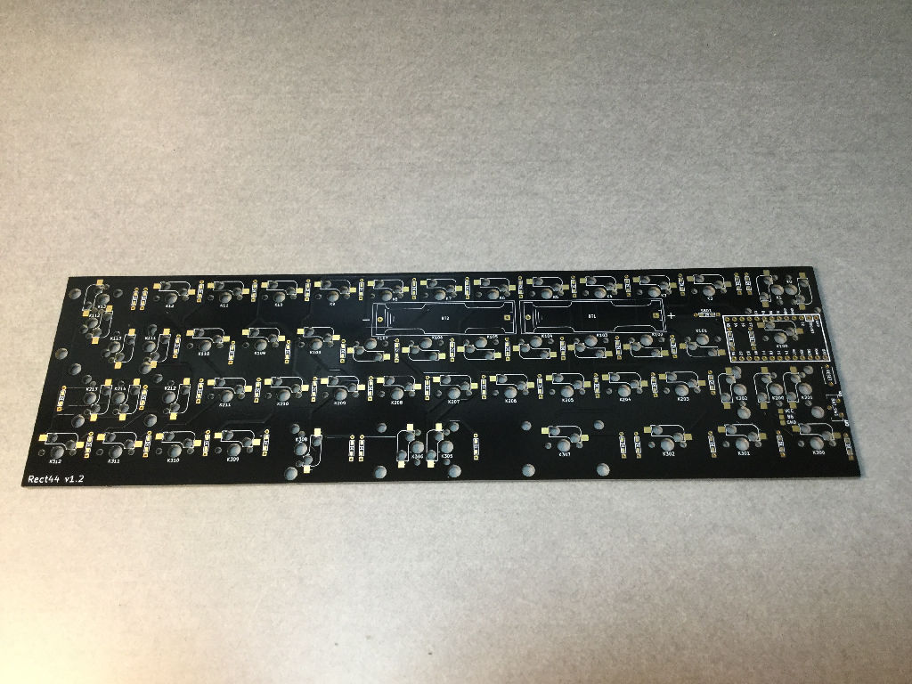 |  | 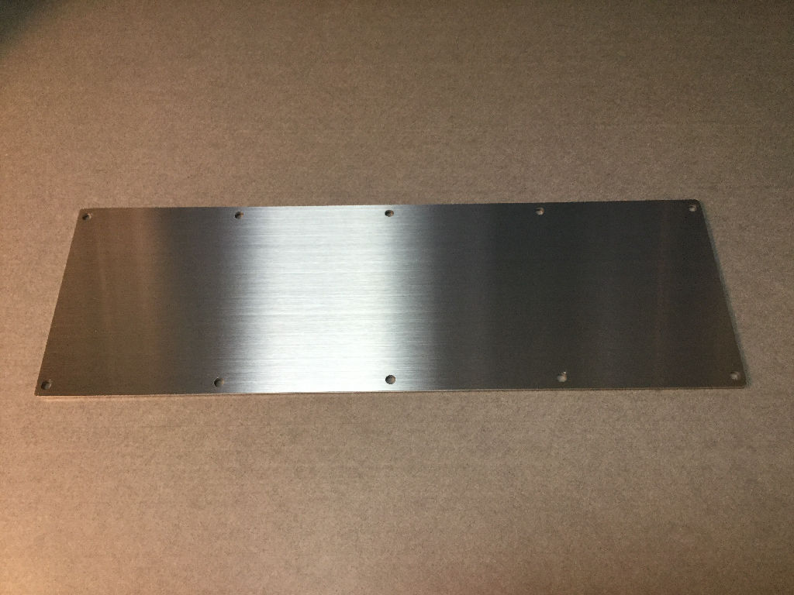 |  |
| ---- | ---- | ---- | ---- |
|基板|ステンレスケース|ステンレス底板|ProMicro脱落防止板|
|  | 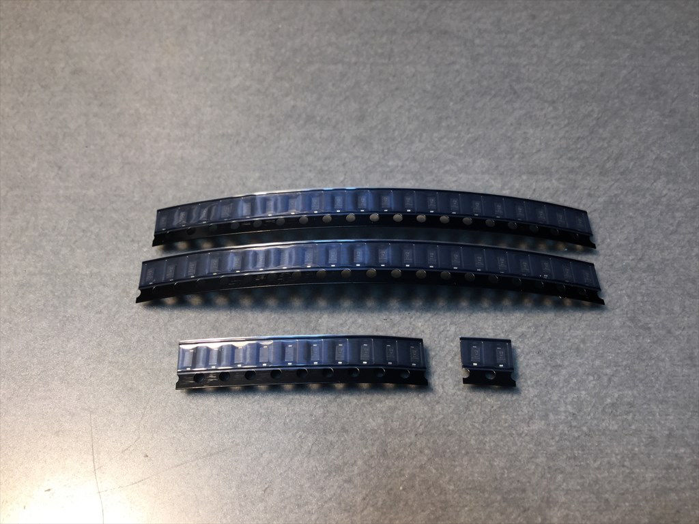 |  |  |
|MX互換ソケット|ダイオード|ショットキーバリアダイオード(SMDタイプ)|ショットキーバリアダイオード(THタイプ)|
|  |  |  |  |
|スライドスイッチ|タクトスイッチ|単4電池ケース|12pinコンスルー|
| 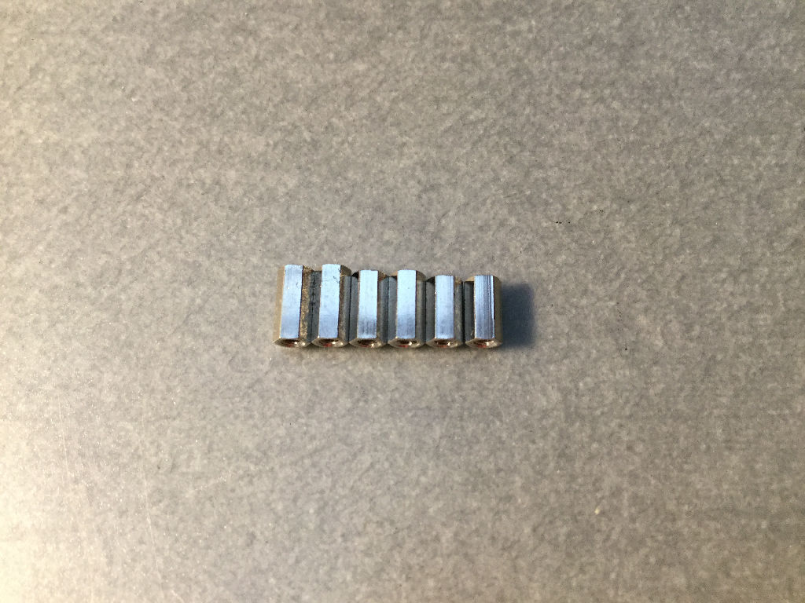 | 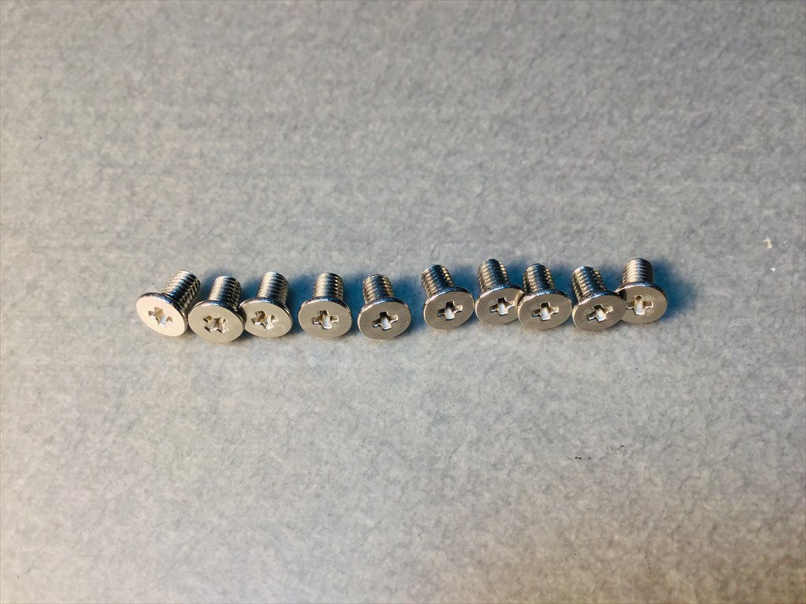 |  | 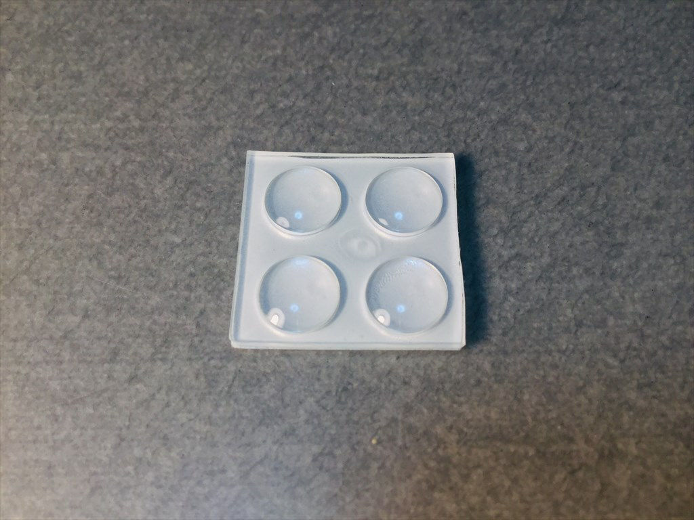|
|M2スペーサー(7mm,6.5mm,6mm 各2個)|M3 低頭ネジ|M2 ナベ小ねじ|クッションシール|

### 別途用意するパーツ
- ProMicroもしくはProMicro互換品：1個
- MX互換キースイッチ：レイアウトにより44～48個
- キーキャップ：キースイッチとレイアウトに合わせたもの
- スタビライザー：キースイッチとレイアウトに合わせたもの


### 必要工具
- ハンダごて（温度調整機能付きがおすすめ）
- ハンダ
- ハンダごてを置く台
- フラックス
- フラックス洗浄液
- ピンセット
- ＋ドライバー
- ニッパー

### あった方が良いもの
- テスター
- はんだ吸い取り線
- 逆作用ピンセット
- 虫眼鏡またはルーペ
- ラジオペンチ
- 耐熱作業マット
- マスキングテープ


## ファームウェア

おすすめは[「のぎけす屋」](https://nogikes.booth.pm/)さんの[ BLE Micro Pro ](https://nogikes.booth.pm/items/1177319)の使用です。  
ファームウェアをビルドする環境の構築も必要ありませんのでお手軽で、かつ、Bluetooth接続ができるようになります。

### BLE Micro Proを使用する場合
現在販売されている「type-c版」を使用してください。以下の手順のように CONFIG.JSN と KEYMAP.JSN を編集してカスタマイズし BLE Micro Proにコピーするだけです。

以前に発売されていた物を使用する場合でも「ブートローダー v0.2版」以降を使用するのであれば「type-c版」と同様の手順で使用できます。それ以前のブートローダー版を使う場合はブートローダーのアップデートかファームウェアのビルドが必要です。

#### CONFIG.JSN
下記内容をコピペして CONFIG.JSN として任意の場所に保存してください。このファイルはキーマップが変わっても変更する必要はありません。
```
{"config":
	{
		"version":2,
		"device_info":{"vid":"0xFEED","pid":"0x0000","name":"rect44","manufacture":"koshinoya","description":""},
		"matrix":{"rows":4,"cols":13,"device_rows":4, "device_cols":13,
		"debounce":1,"is_left_hand":1,"diode_direction":0,
		"row_pins":[1, 2, 19, 20],
		"col_pins":[18, 17, 16, 15, 14, 5, 6, 7, 8, 9, 10, 11, 12],
		"layout":[1, 2, 3, 4, 5, 6, 7, 8, 9, 10, 11, 12, 13, 0,
			 14, 15, 16, 17, 18, 19, 20, 21, 22, 23, 24, 25, 26, 0,
			 27, 28, 29, 30, 31, 32, 33, 34, 35, 36, 37, 38, 39, 0,
			 40, 41, 42, 43, 45, 46, 48, 49, 50, 51, 52]},
		"mode":"SINGLE","startup":1,
		"peripheral":{"max_interval":60,"min_interval":30,"slave_latency":7},
		"central":{"max_interval":60,"min_interval":30,"slave_latency":0},
		"led":{"pin":255, "num":0},
		"keymap":{"locale":"US","use_ascii":0}
}}
```

#### KEYMAP.JSN
KEYMAP.JSNは選んだレイアウトに合わせてカスタマイズします。
キーコードは[ QMK Keycordes ](https://docs.qmk.fm/#/keycodes)と同じです。  
[ BLE Micro Pro固有のキーコード ](https://github.com/sekigon-gonnoc/BLE-Micro-Pro/blob/master/docs/edit_keymap_file.md#ble-micro-pro%E5%9B%BA%E6%9C%89%E3%81%AE%E3%82%AD%E3%83%BC%E3%82%B3%E3%83%BC%E3%83%89)もありますので適宜導入してください。

レイアウトにより使用する、しないが変わるキーは、CONFIG.JSN "layout" セクション中の"13","25","28","38","43","45","46","48"です。
- "13"キー：ANSI配列での右上端のキーです。ISOリターンキーを使用したときには使用できません。
- "25"キー：ISO配列でのセミコロン右側のキーです。2.25uリターンキーを使用した場合には使用できません。
- "28"キー：左Shiftキーを1.25uと1uキーに分割した場合の1uキーです。
- "38"キー：右Shiftキーを1uと1.75uキーに分割した場合の1uキーです。
- "43"キー：6.25uスペースキーを3分割した場合の左2.25uキーです。
- "45"キー：6.25uスペースキーです。
- "46"キー：6.25uスペースキーを3分割した場合の真ん中2.75uキーです。
- "48"キー：6.25uスペースキーを3分割した場合の右1.25uキーです。

6.25uスペースキーを使ったANSI 44キーの場合のサンプル。
```
{"layers":
[["KC_ESC","KC_Q","KC_W","KC_E","KC_R","KC_T","KC_Y","KC_U","KC_I","KC_O","KC_P","KC_MINS","KC_BSPC",
"LCTL_T(KC_TAB)","KC_A","KC_S","KC_D","KC_F","KC_G","KC_H","KC_J","KC_K","KC_L","KC_SCLN","KC_NO","KC_ENT",
"KC_LSFT","KC_NO","KC_Z","KC_X","KC_C","KC_V","KC_B","KC_N","KC_M","KC_COMM","KC_DOT","KC_NO","RSFT_T(KC_SLSH)",
"LCTL_T(KC_DEL)","KC_LGUI","KC_LALT","KC_NO","LT(_FN,KC_SPC)","KC_NO","KC_NO","KC_LEFT","KC_DOWN","KC_UP","KC_RGHT",],

["KC_GRV","KC_F1","KC_F2","KC_F3","KC_F4","KC_F5","KC_F6","KC_F7","KC_F8","KC_F9","KC_F10","KC_F11","KC_F12",
"KC_TRNS","KC_1","KC_2","KC_3","KC_4","KC_5","KC_6","KC_7","KC_8","KC_9","KC_0","KC_NO","KC_EQL",
"KC_TRNS","KC_NO","KC_APP","MO(_FN2)","KC_NO","KC_NO","KC_LBRC","KC_RBRC","KC_QUOT","KC_TRNS","KC_TRNS","KC_NO","KC_BSLS",
"KC_INS","KC_TRNS","KC_TRNS","KC_NO","KC_TRNS","KC_NO","KC_NO","KC_HOME","KC_PGDN","KC_PGUP","KC_END",],

["ADV_ID0","ADV_ID1","ADV_ID2","ADV_ID3","ADV_ID4","KC_NO","KC_NO","KC_NO","KC_NO","KC_PSCR","KC_SLCK","KC_PAUS","KC_NO",
"KC_CAPS","KC_NO","KC_NO","KC_NO","KC_NO","KC_NO","KC_NO","KC_NO","KC_NO","KC_NO","KC_NO","KC_NO","KC_NO",
"KC_TRNS","KC_NO","KC_NO","KC_TRNS","KC_NO","KC_NO","KC_NO","KC_NO","KC_NO","KC_NO","KC_NO","KC_NO","KC_NO",
"KC_LCTL","KC_TRNS","KC_TRNS","KC_NO","KC_TRNS","KC_NO","KC_NO","KC_NO","KC_NO","KC_NO","KC_NO",]]}
```

スペースキーを3分割にして右Shiftキーも分割したANSI 47キーの場合のサンプル
```
{"layers":
[["KC_ESC","KC_Q","KC_W","KC_E","KC_R","KC_T","KC_Y","KC_U","KC_I","KC_O","KC_P","KC_MINS","KC_BSPC",
"LCTL_T(KC_TAB)","KC_A","KC_S","KC_D","KC_F","KC_G","KC_H","KC_J","KC_K","KC_L","KC_SCLN","KC_NO","KC_ENT",
"KC_LSFT","KC_NO","KC_Z","KC_X","KC_C","KC_V","KC_B","KC_N","KC_M","KC_COMM","KC_DOT","KC_SLSH","RSFT_T(KC_UP)",
"LCTL_T(KC_DEL)","KC_LGUI","KC_LALT","LT(1,KC_SPC)","KC_NO","RSFT_T(KC_SPC)","KC_RALT","MO(2)","KC_LEFT","KC_DOWN","KC_RGHT",],

["KC_GRV","KC_F1","KC_F2","KC_F3","KC_F4","KC_F5","KC_F6","KC_F7","KC_F8","KC_F9","KC_F10","KC_F11","KC_F12",
"KC_TRNS","KC_1","KC_2","KC_3","KC_4","KC_5","KC_6","KC_7","KC_8","KC_9","KC_0","KC_NO","KC_EQL",
"KC_TRNS","KC_NO","KC_APP","KC_NO","KC_NO","KC_NO","KC_LBRC","KC_RBRC","KC_QUOT","KC_TRNS","KC_TRNS","KC_BSLS","RSFT_T(KC_PGUP)",
"LCTL_T(KC_INS)","KC_TRNS","KC_TRNS","KC_TRNS","KC_NO","KC_TRNS","KC_TRNS","KC_TRNS","KC_HOME","KC_PGDN","KC_END",],

["ADV_ID0","ADV_ID1","ADV_ID2","ADV_ID3","ADV_ID4","KC_NO","KC_NO","KC_NO","KC_NO","KC_PSCR","KC_SLCK","KC_PAUS","KC_NO",
"KC_CAPS","KC_NO","KC_NO","KC_NO","KC_NO","KC_NO","KC_NO","KC_NO","KC_NO","KC_NO","KC_NO","KC_NO","KC_NO",
"KC_TRNS","KC_NO","KC_NO","KC_NO","KC_NO","KC_NO","KC_NO","KC_NO","KC_NO","KC_NO","KC_NO","KC_NO","KC_NO",
"KC_LCTL","KC_TRNS","KC_TRNS","KC_NO","KC_NO","KC_NO","KC_NO","KC_TRNS","KC_NO","KC_NO","KC_NO",]]}
```

ISOエンターキーを使った48キーの場合のサンプル
```
{"layers":
[["KC_ESC","KC_Q","KC_W","KC_E","KC_R","KC_T","KC_Y","KC_U","KC_I","KC_O","KC_P","KC_DEL","KC_NO",
"LCTL_T(KC_TAB)","KC_A","KC_S","KC_D","KC_F","KC_G","KC_H","KC_J","KC_K","KC_L","KC_SCLN","KC_QUOT","KC_ENT",
"KC_LSFT","LSFT_T(KC_NUBS)","KC_Z","KC_X","KC_C","KC_V","KC_B","KC_N","KC_M","KC_COMM","KC_DOT","KC_SLSH","RSFT_T(KC_UP)",
"LCTL_T(KC_INS)","KC_LGUI","KC_LALT","LT(1,KC_SPC)","KC_NO","RSFT_T(KC_SPC)","KC_RALT","MO(2)","KC_LEFT","KC_DOWN","KC_RGHT",],

["KC_GRV","KC_F1","KC_F2","KC_F3","KC_F4","KC_F5","KC_F6","KC_F7","KC_F8","KC_F9","KC_F10","KC_BSPC","KC_NO",
"KC_TRNS","KC_1","KC_2","KC_3","KC_4","KC_5","KC_6","KC_7","KC_8","KC_9","KC_0","KC_MINS","KC_EQL",
"KC_TRNS","KC_NO","KC_APP","KC_NO","KC_NO","KC_NO","KC_LBRC","KC_RBRC","KC_NUHS","KC_TRNS","KC_TRNS","KC_BSLS","RSFT_T(KC_PGUP)",
"KC_TRNS","KC_TRNS","KC_TRNS","KC_TRNS","KC_NO","KC_TRNS","KC_TRNS","KC_TRNS","KC_HOME","KC_PGDN","KC_END",],

["ADV_ID0","ADV_ID1","ADV_ID2","ADV_ID3","ADV_ID4","KC_NO","KC_NO","KC_NO","KC_NO","KC_PSCR","KC_SLCK","KC_PAUS","KC_NO",
"KC_CAPS","KC_NO","KC_NO","KC_NO","KC_NO","KC_NO","KC_NO","KC_NO","KC_NO","KC_NO","KC_NO","KC_NO","KC_NO",
"KC_TRNS","KC_NO","KC_NO","KC_NO","KC_NO","KC_NO","KC_NO","KC_NO","KC_NO","KC_NO","KC_NO","KC_NO","KC_NO",
"KC_TRNS","KC_TRNS","KC_TRNS","KC_NO","KC_NO","KC_NO","KC_TRNS","KC_TRNS","KC_NO","KC_NO","KC_NO",]]}
```

上記サンプルのうちお好きなものをコピペして KEYMAP.JSN として保存してください。もちろんカスタマイズもOKです。

#### 書き込み
BLE Micro Pro をUSBケーブルでPCにつなぐとUSBメモリを接続したときのように認識されるので、作成した CONFIG.JSN と KEYMAP.JSN を BLE Micro Pro 側にコピーしてください。

|  |
| ---- |
|上の図では CONFIG.JSN の "device_info" 中の "name" を rect44-3 としているのでそのように認識されています。|

CONFIG.JSN、KEYMAP.JSN は下記リンク先にもありますのでリネームして御利用ください。  
https://github.com/sekigon-gonnoc/BLE-Micro-Pro/tree/master/AboutDefaultFirmware/keyboards/rect44

### ProMicroを使用する場合

#### 環境の構築
基本的にはここ  
[ The Complete Newbs Guide To QMK ](https://docs.qmk.fm/#/newbs)  
ですが、英語が苦手という方は  

[ QMK firmware ファームウェアの初歩の初歩　１ ](http://roudokuvip.hateblo.jp/entry/2018/04/29/013126)  
がおすすめです。  
ここからの一連の記載はとても参考になり、私はこれを見てQMKの環境を構築しました。


#### カスタマイズ
[ QMK Configurator ](https://config.qmk.fm/)が使用できますので、`KEYBOARD：`に`rect44`と入れればANSI 47 キーバージョンが表示されます。  
その他のレイアウト(ANSI 47キー配列とISO 48キー配列)については下記内容をコピー＆ペーストし`.json`ファイルとして任意の場所に保存して、QMK Configurator 内の `QMK Keymap JSON ファイルをインポートボタン`を押して読み込ませてください。  


ansi_44key.json (ANSI 44 key レイアウト例)
```
{
  "keyboard": "rect44",
  "keymap": "default",
  "commit": "",
  "layout": "LAYOUT_ansi_44key",
  "layers": [
    [
      "KC_ESC","KC_Q","KC_W","KC_E","KC_R","KC_T","KC_Y","KC_U","KC_I","KC_O","KC_P","KC_MINS","KC_BSPC",
      "LCTL_T(KC_TAB)","KC_A","KC_S","KC_D","KC_F","KC_G","KC_H","KC_J","KC_K","KC_L","KC_SCLN","KC_ENT",
      "KC_LSFT","KC_Z","KC_X","KC_C","KC_V","KC_B","KC_N","KC_M","KC_COMM","KC_DOT","RSFT_T(KC_SLSH)",
      "LCTL_T(KC_DEL)","KC_LGUI","KC_LALT","LT(1,KC_SPC)","KC_LEFT","KC_DOWN","KC_UP","KC_RGHT"
    ],
    [
      "KC_GRV","KC_F1","KC_F2","KC_F3","KC_F4","KC_F5","KC_F6","KC_F7","KC_F8","KC_F9","KC_F10","KC_F11","KC_F12",
      "KC_TRNS","KC_1","KC_2","KC_3","KC_4","KC_5","KC_6","KC_7","KC_8","KC_9","KC_0","KC_EQL",
      "KC_TRNS","KC_APP","MO(2)","KC_NO","KC_NO","KC_LBRC","KC_RBRC","KC_QUOT","KC_TRNS","KC_TRNS","KC_BSLS",
      "KC_INS","KC_TRNS","KC_TRNS","KC_TRNS","KC_HOME","KC_PGDN","KC_PGUP","KC_END"
    ],
    [
      "KC_NO","RGB_TOG","RGB_HUI","RGB_SAI","RGB_VAI","KC_NO","KC_NO","KC_NO","KC_NO","KC_PSCR","KC_SLCK","KC_PAUS","KC_NO",
      "KC_CAPS","RGB_MOD","RGB_HUD","RGB_SAD","RGB_VAD","KC_NO","KC_NO","KC_NO","KC_NO","KC_NO","KC_NO","KC_NO",
      "KC_TRNS","KC_NO","KC_TRNS","KC_NO","KC_NO","KC_NO","KC_NO","KC_NO","KC_NO","KC_NO","KC_NO",
      "KC_LCTL","KC_TRNS","KC_TRNS","KC_TRNS","KC_NO","KC_NO","KC_NO","KC_NO"
    ]
  ]
}
```
iso_ 48key.json (ISO 48 key レイアウト例)
```
{
  "keyboard": "rect44",
  "keymap": "default",
  "commit": "",
  "layout": "LAYOUT_iso_48key",
  "layers":[
    [
      "KC_ESC","KC_Q","KC_W","KC_E","KC_R","KC_T","KC_Y","KC_U","KC_I","KC_O","KC_P","KC_BSPC","KC_ENT",
      "LCTL_T(KC_TAB)","KC_A","KC_S","KC_D","KC_F","KC_G","KC_H","KC_J","KC_K","KC_L","KC_SCLN","KC_QUOT",
      "KC_LSFT","KC_NUBS","KC_Z","KC_X","KC_C","KC_V","KC_B","KC_N","KC_M","KC_COMM","KC_DOT","KC_SLSH","RSFT_T(KC_UP)",
      "KC_LCTL","KC_LGUI","KC_LALT","LT(1,KC_SPC)","RSFT_T(KC_SPC)","KC_RALT","MO(2)","KC_LEFT","KC_DOWN","KC_RGHT"
    ],
    [
      "KC_GRV","KC_F1","KC_F2","KC_F3","KC_F4","KC_F5","KC_F6","KC_F7","KC_F8","KC_F9","KC_F10","KC_DEL","KC_EQL",
      "KC_TRNS","KC_1","KC_2","KC_3","KC_4","KC_5","KC_6","KC_7","KC_8","KC_9","KC_0","KC_MINS",
      "KC_TRNS","KC_NO","KC_APP","KC_F11","KC_F12","KC_NO","KC_LBRC","KC_RBRC","KC_NUHS","KC_TRNS","KC_TRNS","KC_TRNS","KC_PGUP",
      "KC_INS","KC_TRNS","KC_TRNS","KC_TRNS","KC_TRNS","KC_TRNS","KC_TRNS","KC_HOME","KC_PGDN","KC_END"
    ],
    [
      "KC_NO","RGB_TOG","RGB_HUI","RGB_SAI","RGB_VAI","KC_NO","KC_NO","KC_NO","KC_NO","KC_PSCR","KC_SLCK","KC_PAUS","KC_NO",
      "KC_CAPS","RGB_MOD","RGB_HUD","RGB_SAD","RGB_VAD","KC_NO","KC_NO","KC_NO","KC_NO","KC_NO","KC_NO","KC_NO",
      "KC_TRNS","KC_NO","KC_NO","KC_NO","KC_NO","KC_NO","KC_NO","KC_NO","KC_NO","KC_NO","KC_NO","KC_NO","KC_NO",
      "KC_LCTL","KC_TRNS","KC_TRNS","KC_NO","KC_TRNS","KC_TRNS","KC_TRNS","KC_NO","KC_NO","KC_NO"
    ]
  ]
}
```  


そのほか手を入れていろいろしたい方は QMK にマージされているので御利用ください。

## 組み立て
ここからはハンダ付け作業を200カ所以上行います。  
ハンダ作業に不慣れな方や不安を覚える方は、ゴッドはんだ株式会社さんが公開してくれている [ WEB版　はんだ付け基礎講座 ](https://godhanda.co.jp/kouza/) を一通り読むことを推奨します。

部品を取り付ける面は左下に「Rect44 v1.2」と表記されている側です。

### キースイッチ用ダイオード
付属しているダイオードは表面実装(SMD)タイプの物ですが、この基板はスルーホールタイプのダイオードも実装できるようにしていますので、表面実装タイプの取り付けに自信が無いという方は、別途スルーホールタイプのダイオードを入手して取り付けることもできます。使用するダイオードは入手性の良い「1N4148」がおすすめです。  
[秋月電子通商さん](http://akizukidenshi.com/catalog/g/gI-00941/)  
[TALP KEYBOARDさん](https://talpkeyboard.stores.jp/items/59eadbffc8f22c15de001638)  
などで入手できます。

|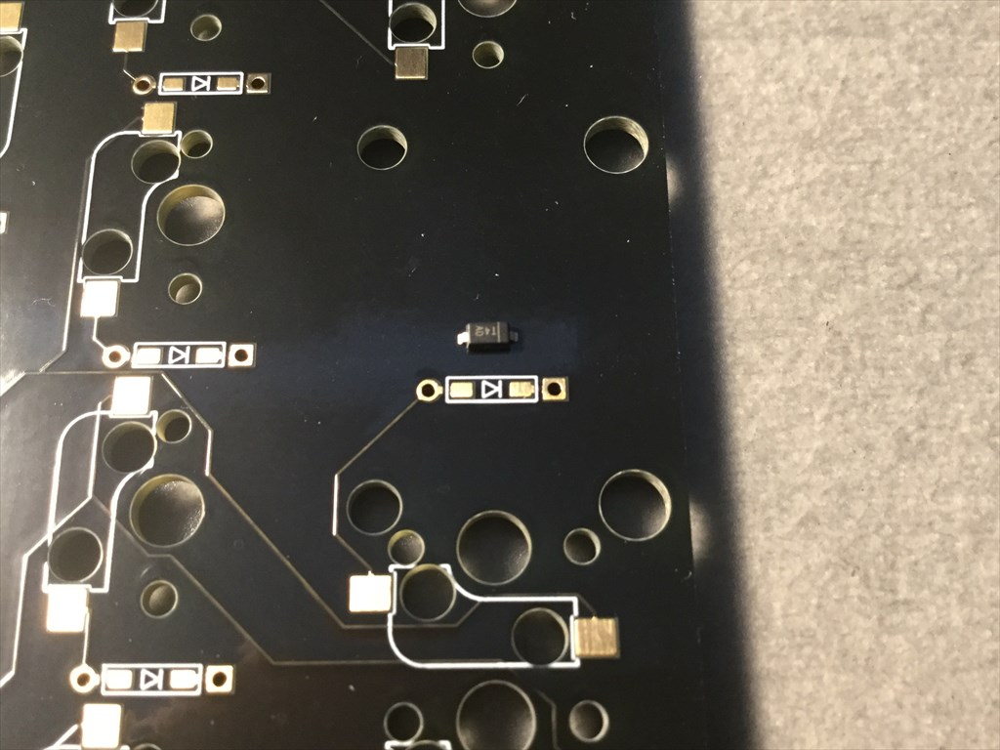|
| ---- |
|基板上のダイオードマークの棒の位置とダイオードの線のある方向を合わせてハンダ付けします。あらかじめ片方のパッドに予備ハンダをしておき、そのパッドにハンダ付けしたあとに反対側をハンダ付けします。ここでもゴッドはんださんの[ 15 チップ部品のはんだ付け（表面実装） ](https://godhanda.co.jp/blog/kisokouza15/)が参考になると思います。|

### ショットキーバリアダイオード
表面実装(SMD)タイプとスルーホール(TH)タイプ両方が付属部品として同封されていますが、どちらか１つしか使用しません。表面実装タイプのハンダ付けが苦手な方はスルーホールタイプを使用してください。  
やり方はキースイッチ用ダイオードと同じです。また、作業性を良くするために、必ず電池ケースよりも先に取り付けてください。

||
| ---- | ---- |
|キースイッチ用ダイオードとパッケージが酷似していますが、白い点が打たれているものがショットキーバリアダイオードです。|電池ボックスとコントローラ取り付け部の間にSDB1とシルクで表示されているパッドが取り付け位置です。ダイオードのカソードを表示する線をProMicro取付部側に向けてハンダ付けしてください。|
||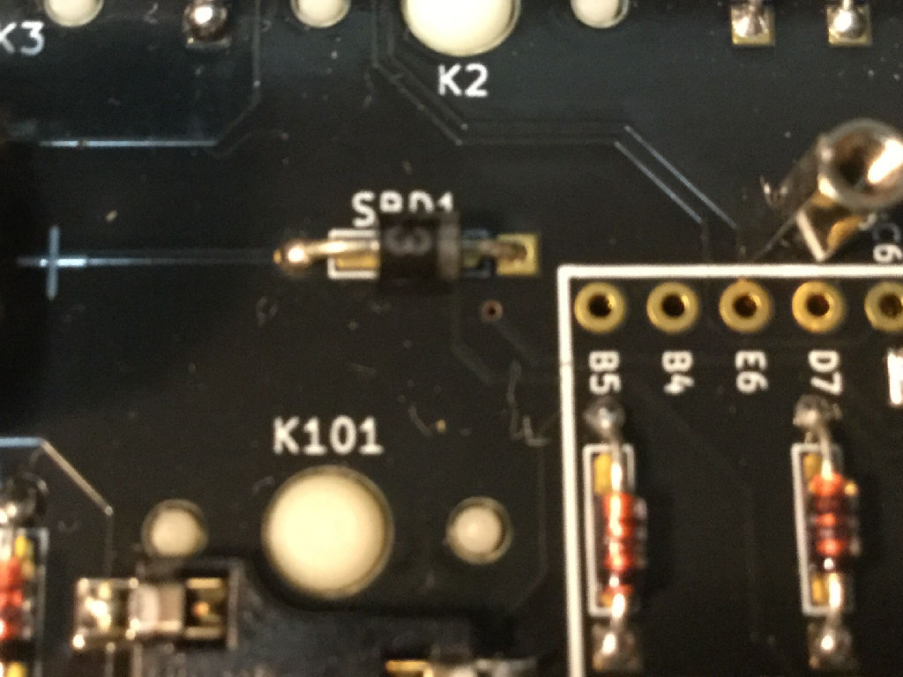
|ショットキーバリアダイオード(THタイプ)|電池ボックスとコントローラ取り付け部の間にSDB1とシルクで表示されているパッドが取り付け位置です。ダイオードのカソードを表示する線をProMicro取付部側に向けてハンダ付けしてください。|


### ソケット
|||
| ---- | ---- |
|白いふち取りがありますので、それに合わせてハンダ付けしてください。逆向きでもハンダ付けできてしまうので注意してください。|コントローラの下に入るソケットは念のためコンスルーを取り付けた状態でハンダ付けしてください。|

### 電源スイッチ、リセットスイッチ
|||
| ---- | ---- |
|取り付け場所|写真のようにシルクに合わせて部品を置き|
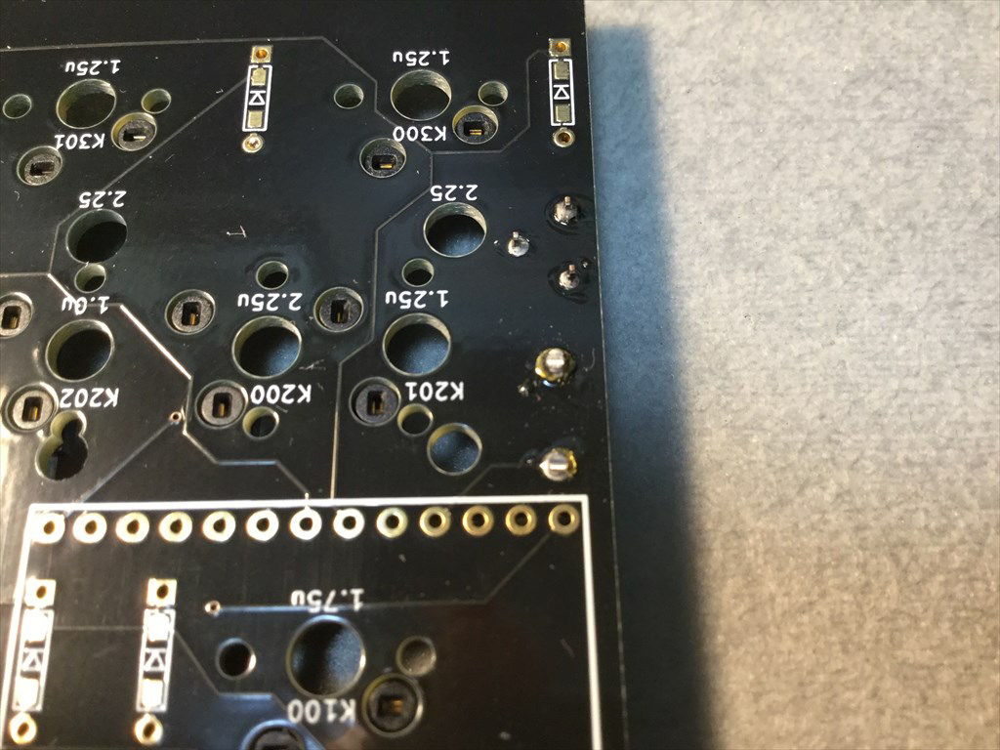| |
|裏側からハンダ付けしてください。| |

### 電池ケース
この基板に取り付ける部品の中では最も背が高いので最後にハンダ付けします。

||
| ---- |
|プラスマイナスの方向を間違えないようにシルクがある側に電池ケースを置いて反対側からハンダ付けしてください。ハンダ後は余ったピンをニッパーで切り落としてください。|

### BLE Micro Pro
|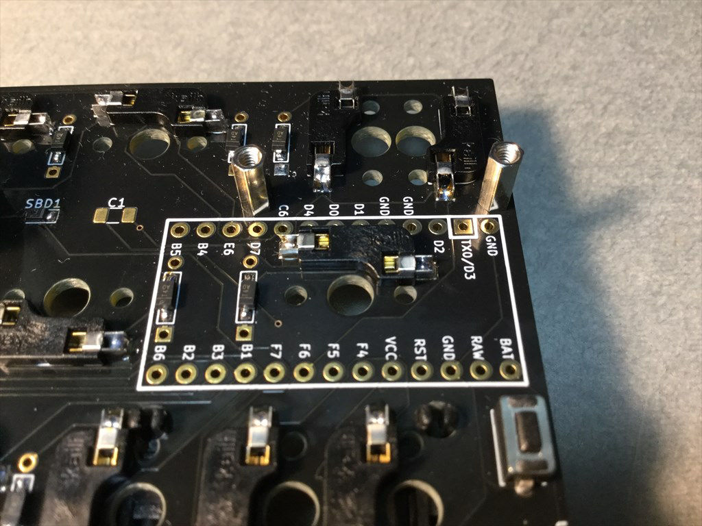||
| ---- | ---- |
|脱落防止板用のスペーサーを立てる。| |
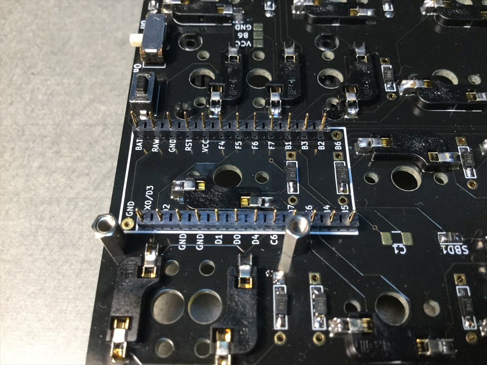|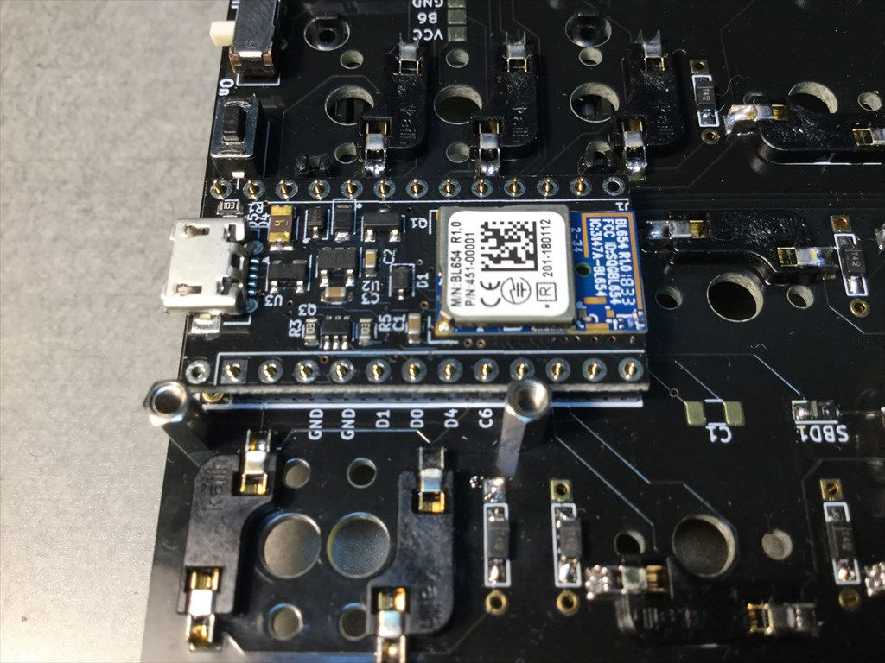|
|次にコンスルーを取り付けます。このとき"BAT"側の列は"BAT"にかかり"B6"にかからない位置に、反対側の列は"B5"にかかり"GND"にかからない位置に取り付けてください。また、コンスルー横の窓は同じ向きになるようにしてください。|BLE Micro Proをはめる。|
|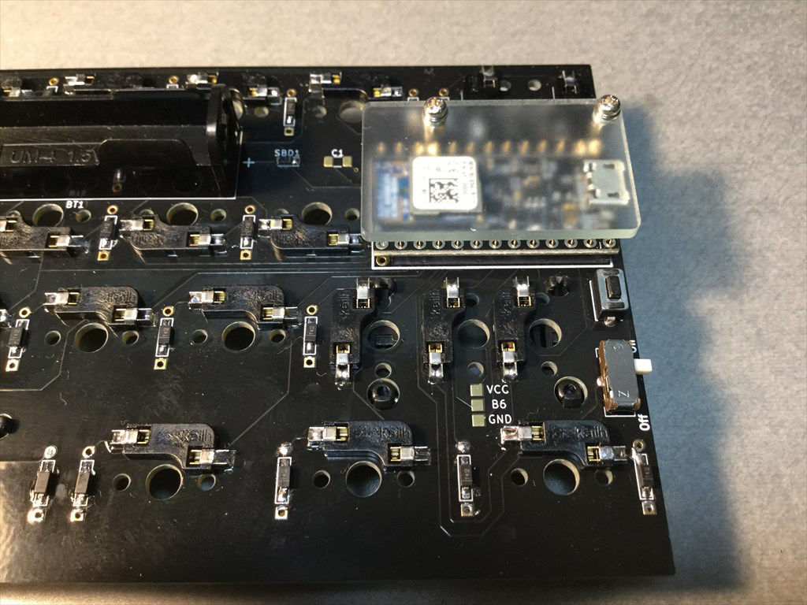| |
|脱落防止板を取り付ける。| |

### ProMicro
|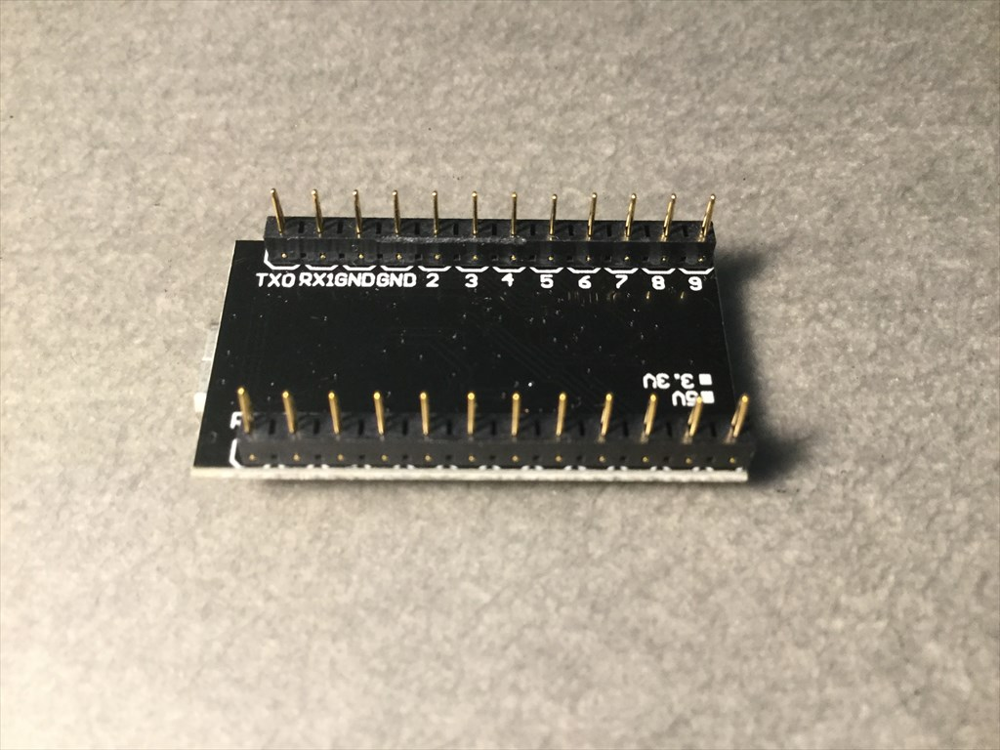|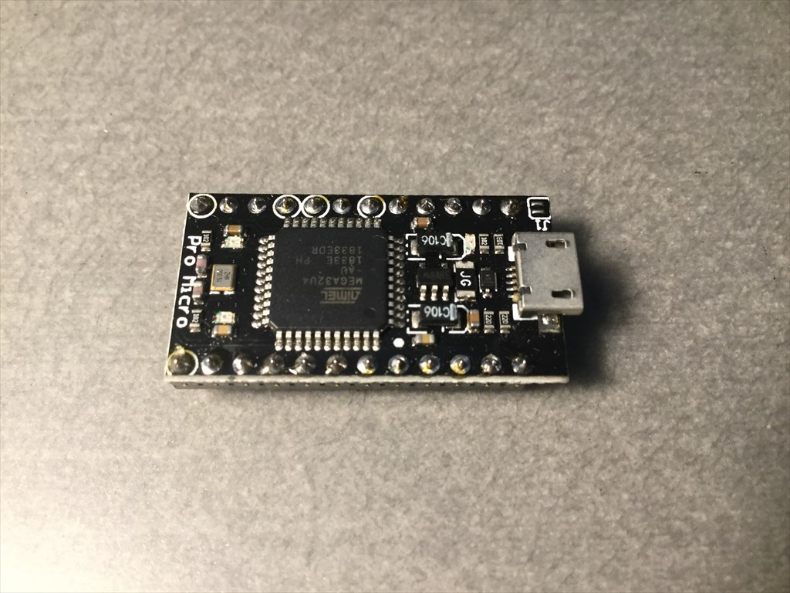|
| ---- | ---- |
|ProMicroを使用する場合にはコンスルーとハンダ付けが必要です。下の写真のようにコンスルーの窓の向きを同じ方向にして、窓がProMicro側に近くなるようにハンダ付けします。

このハンダ付けしたものを基板端の"BAT"と"GND"を使わない位置（"B5"と"B6"を使用する位置）に取り付けます。  
取り付けた後、BLE Micro Proと同様に脱落防止板を取り付けます。

本キットは基板の色やその他使用している部品も黒を基調とした色なので、ProMicroを使用する方は [ かぎざら屋さんのKamisori ](https://booth.pm/ja/items/1500088) などもおすすめです。コンスルーにも対応してますので、ハンダ付けの必要もありません。

### スタビライザ
レイアウトに合わせたスタビライザーを取り付けてください。  

||
| ---- |
|写真はANSI配列47キー（右Shiftとスペースバーを分割）の場合の例です。|

### キースイッチ＆キーキャップ
基板のネジ止めがありませんので、Qキー、Pキー、Hキー、左下端、右下端のキースイッチをはめてから他のスイッチを嵌めるとやりやすいと思います。
キーキャップはお好みのものを取り付けてください。

商品説明でも触れましたが、キースイッチの一部には90°または180°回転させて取り付けるものがあるため、キースイッチとキーキャップの組み合わせによっては底打ちした場合にスイッチとキャップが当たる可能性があります。（特にキーキャップの形状がCherryプロファイルの場合）
推奨するプロファイルはフラットなDSAやXDA、または背の高いSA等です。

ちなみに商品説明にも使用している下の写真のキーキャップセットは、~~TALP KEYBOARDさんで販売している「XDA PBT dye-sub 104 キーキャップセット (Italic font/Gray)」です。
https://talpkeyboard.stores.jp/items/5c318309c2fc28537c505b45~~  
こちらは終売になってしまったようです。  
今は遊舎工房さんで販売している「KBDFANS R1 XDA DYE-SUB 60% 65% KEYCAPS」  
https://yushakobo.jp/shop/kbdfans-r1-xda-dye-sub-60-65-keycaps/  
が相当するキーキャップのようです。

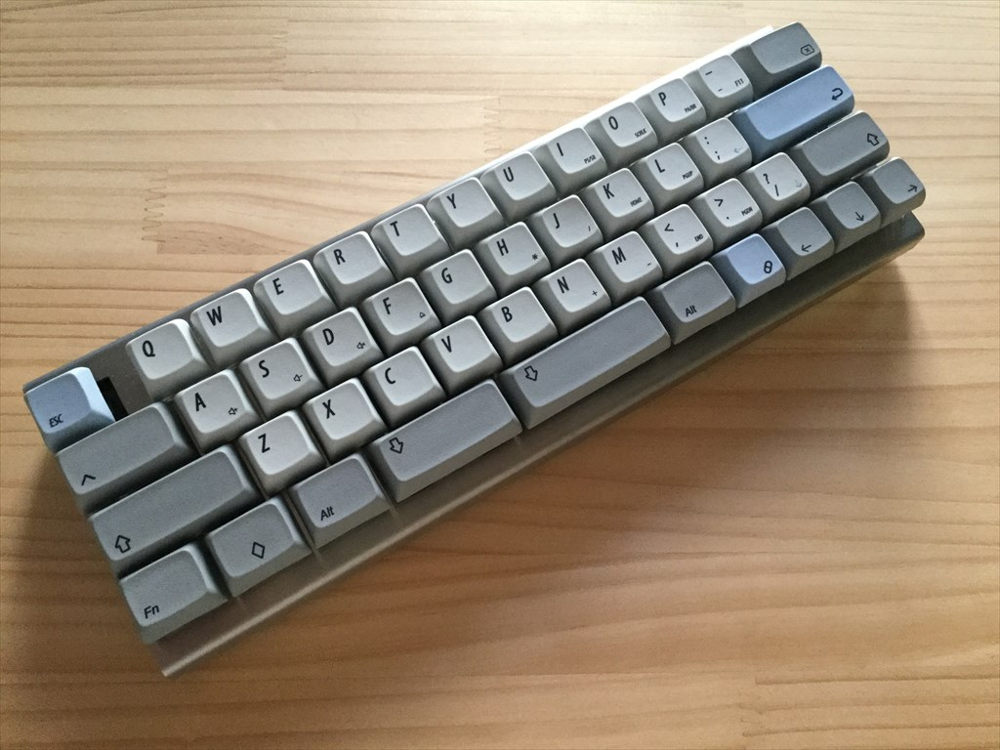

Shiftキーのサイズが充実しておりISOエンターキーも付属しているため、本キーボードキットにおすすめです。

### 底板
|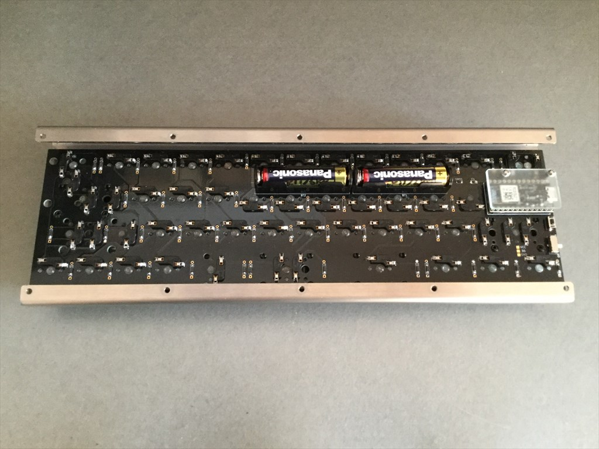|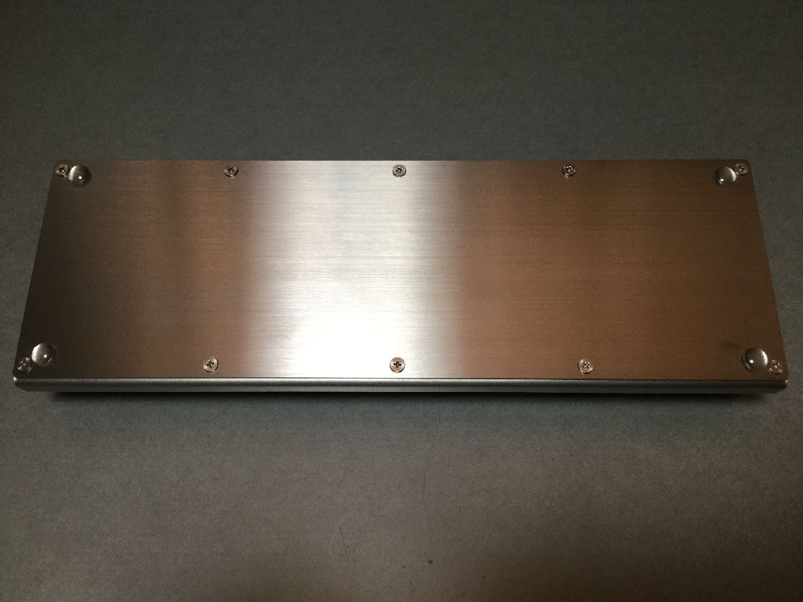|
| ---- | ---- |
|単4乾電池を入れて、底板を付属の M3 低頭ネジで取り付け四隅にクッションシールを貼ります。|底板はきれいな仕上がりの面を外側にしてください。|


## 完成
これにて完成です。
困ったことがあれば御連絡ください、できるだけ対応したいと思っています。（ネジを無くしたなどでもOKです！）

また、このビルドガイドに間違いや追加情報があれば御連絡ください。（BOOTH経由もしくは作者Twitter:@KoshinoyaK）即時対応できないかもしれませんが御容赦ください。


## 謝辞
このビルドガイドを作成する際にnrtkbb氏の [uzu42ビルドガイド](https://github.com/nrtkbb/Keyboards/blob/master/uzu42/build_guide_jp.md) を参考にさせていただきました。ありがとうございました。
